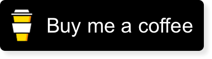

# BuyMeACoffee ☕️!
[Buy Me a Coffee](https://www.buymeacoffee.com) framework for iOS.

[](https://www.buymeacoffee.com/appcraftstudio)

## Installation

### CocoaPods

Add the following entry to your Podfile:

```rb
pod 'BuyMeACoffee'
```

Then run `pod install`.

Don't forget to `import BuyMeACoffee` in every file you'd like to use BuyMeACoffee.

### Swift Package Manager

To integrate using Apple's Swift package manager, add the following as a dependency to your `Package.swift`:

```swift
.package(url: "https://github.com/appcraftstudio/buymeacoffee.git", .upToNextMajor(from: "1.0.0"))
```

and then specify `"BuyMeACoffee"` as a dependency of the Target in which you wish to use BuyMeACoffee.
Here's an example `PackageDescription`:

```swift
// swift-tools-version:4.0
import PackageDescription

let package = Package(
    name: "MyPackage",
    products: [
        .library(
            name: "MyPackage",
            targets: ["MyPackage"]),
    ],
    dependencies: [
        .package(url: "https://github.com/appcraftstudio/buymeacoffee.git", .upToNextMajor(from: "1.0.0"))
    ],
    targets: [
        .target(
            name: "MyPackage",
            dependencies: ["BuyMeACoffee"])
    ]
)
```
